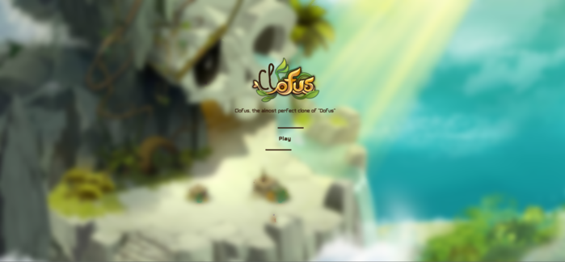

# Dofus clone

"Clofus" is a mini-game highly inspired by the game Dofus. This is my first project using JavaScript. I challenged myself to work on this project for a period of only 2 weeks to see how far I could go in terms of development.

## The game

This game includes a home map where the player can move freely thanks to the implementation of Dijkstra pathfinding algorithm.
Then, the player has access to a tactical battle against a monster when entering the cave. The goal is to cross the minogolem's labyrinth to obtain a very powerful object.

/!\ The game is not optimized for mobile 

## The difficulty 

The principle of this tactical battle is taken from the game dofus itself. Normally, in dofus, there are no rules given to the player to perform this fight. The player has to die and re-try until he understands the ins and outs of the fight. 
For this mini-game, I decided to explain briefly the rules to the player to make it faster. On the other hand, the player will inevitably die a few times before succeeding, the battle remains quite complex ! 

## Link 

- [Live site URL here](https://tristanberger6.github.io/Dofus-like-game/) 

